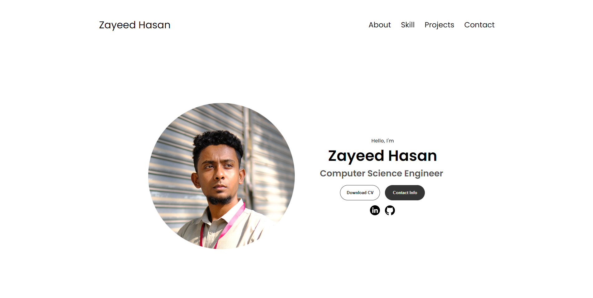
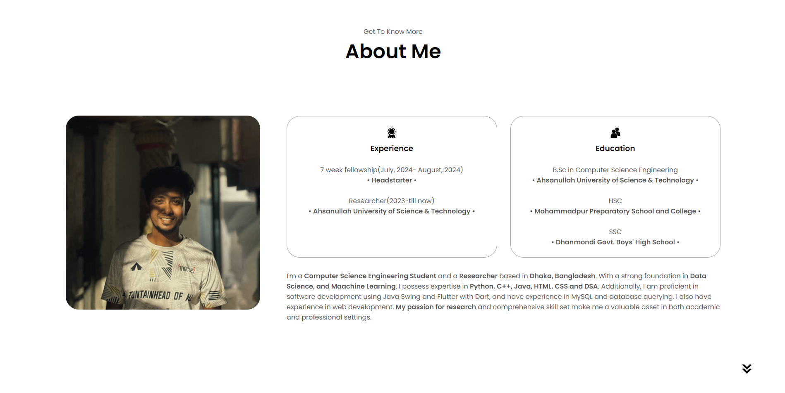
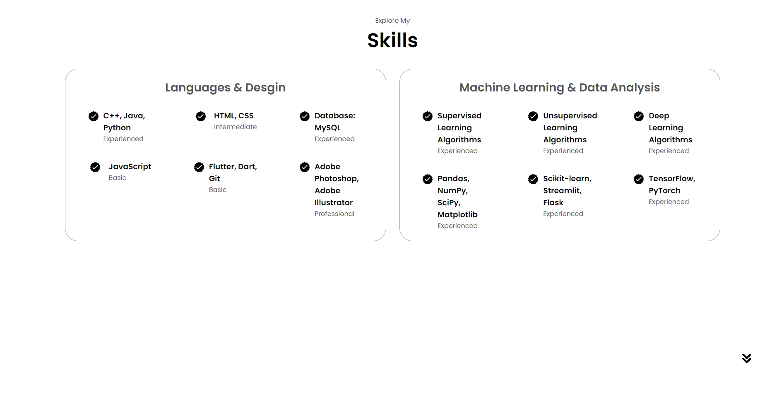
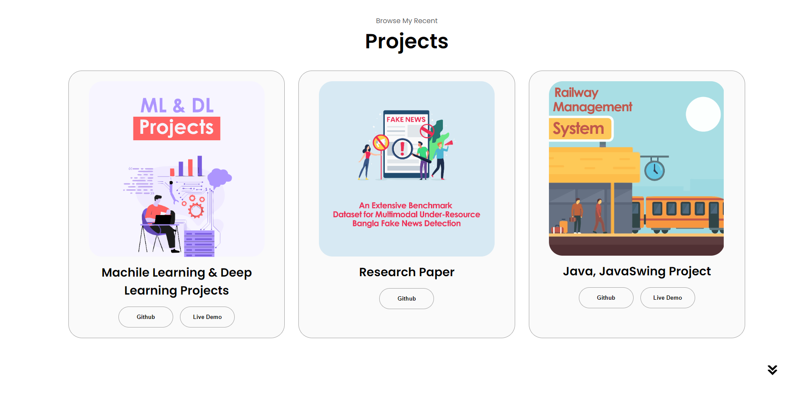
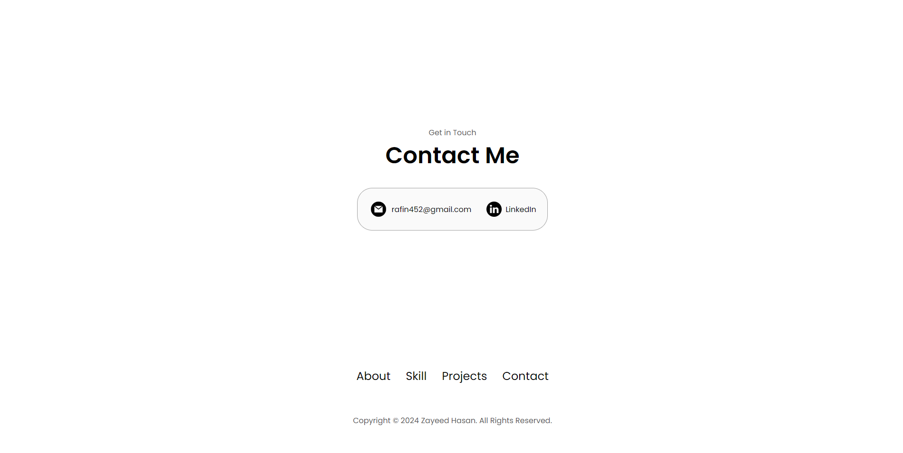
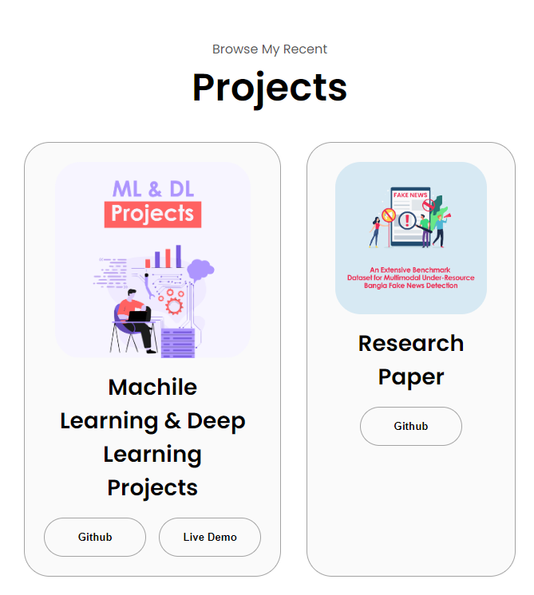
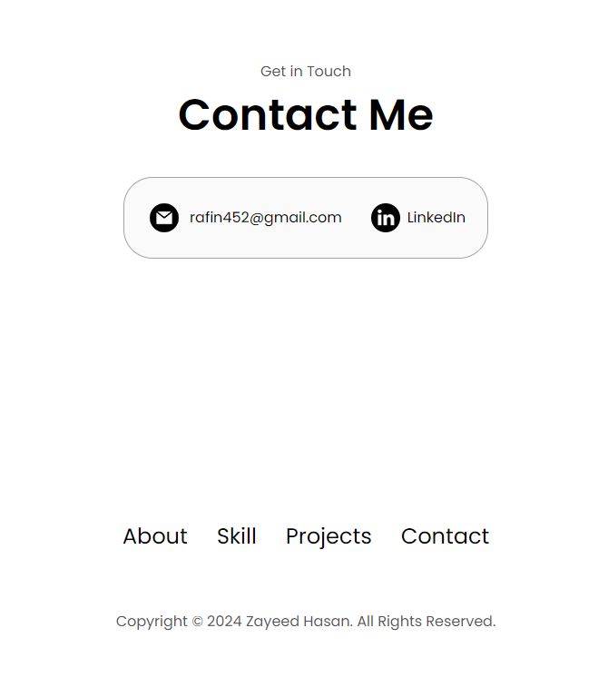

Here's an ultra-detailed `README.md` file for your personal portfolio website:

---

# Personal Portfolio Website

Welcome to my personal portfolio website! This project showcases my work, skills, and experiences. It features a modern design with smooth transitions, responsive layout, and interactive elements. Below you'll find details on the project setup, features, and usage.

## Table of Contents

- [Project Overview](#project-overview)
- [Features](#features)
- [Technologies Used](#technologies-used)
- [Installation](#installation)
- [Usage](#usage)
- [Screenshots](#screenshots)
- [Contributing](#contributing)
- [License](#license)

## Project Overview

This personal portfolio website is designed to highlight my professional achievements and skills. The site includes sections such as:

- **Profile:** An introduction with a dynamic text effect showcasing my roles.
- **About:** Details about my background and experience.
- **Experience:** A summary of my professional experiences.
- **Projects:** A display of projects I've worked on.
- **Contact:** Information on how to get in touch with me.

## Features

- **Dynamic Role Typing Effect:** A JavaScript-powered text effect that cycles through various professional roles.
- **Responsive Design:** Adaptable layout that adjusts to different screen sizes using CSS media queries.
- **Interactive Hamburger Menu:** A modern, responsive navigation menu for mobile devices.
- **Smooth Transitions:** CSS transitions for a polished user experience.
- **Modern Aesthetics:** Clean design with attention to typography, spacing, and visual hierarchy.

## Technologies Used

- **HTML:** Structure of the website.
- **CSS:** Styling and layout, including responsive design and animations.
- **JavaScript:** Interactive features such as the dynamic typing effect and hamburger menu.
- **Google Fonts:** Used for typography (`Poppins` font).
- **GitHub Pages:** For deployment (if applicable).

## Installation

To set up the project locally:

1. **Clone the Repository:**

   ```bash
   git clone https://github.com/zhrafin/personal-portfolio-website.git
   ```

2. **Navigate to the Project Directory:**

   ```bash
   cd personal-portfolio-website
   ```

3. **Open `index.html` in Your Web Browser:**

   You can use any web browser to view the portfolio.

## Usage

To use the website, simply navigate through the sections using the navigation bar or hamburger menu on mobile devices. The site is designed to provide a seamless experience across different devices and screen sizes.

### Features Overview

- **Dynamic Text Effect:** This feature showcases my roles and skills in a visually engaging manner.
- **Responsive Layout:** The site adjusts to different screen sizes, ensuring a consistent experience on desktops, tablets, and smartphones.
- **Interactive Elements:** The hamburger menu provides a user-friendly navigation experience on mobile devices.

## Screenshots

### GUI

### Web view


<div style="display: flex; gap: 10px; justify-content: center;">
    
    
</div>

<div style="display: flex; gap: 10px; justify-content: center;">
    
    
</div>

### Mobile View

<div style="display: flex; gap: 10px; justify-content: center;">
    
    
</div>

   

## Contributing

If you would like to contribute to this project, please follow these steps:

1. **Fork the Repository**
2. **Create a New Branch:**

   ```bash
   git checkout -b feature/your-feature
   ```

3. **Make Your Changes**
4. **Commit Your Changes:**

   ```bash
   git commit -m "Add some feature"
   ```

5. **Push to the Branch:**

   ```bash
   git push origin feature/your-feature
   ```

6. **Open a Pull Request**

## License

This project is licensed under the MIT License - see the [LICENSE](LICENSE) file for details.

---
